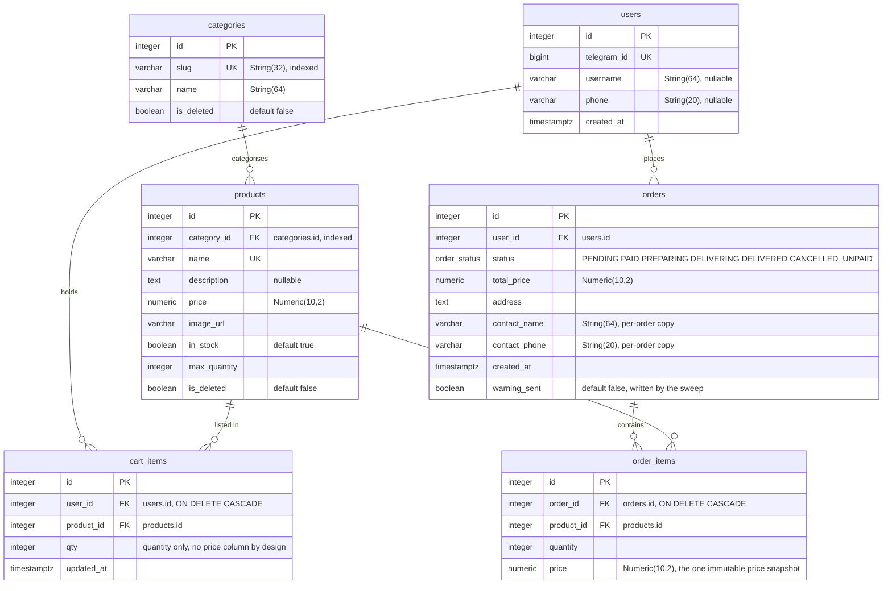
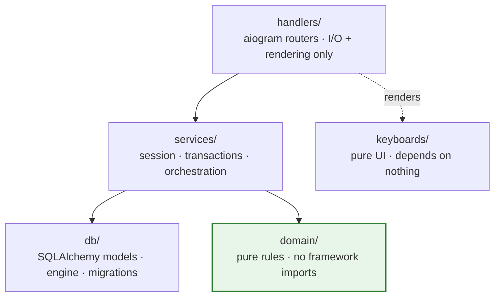

# Piatto v2

Telegram bot for food ordering at a single restaurant: catalogue, cart, checkout and
manual payment confirmation — all inside Telegram.

## Demo

<!-- Live bot: @______bot — add the link after deploy -->



cart_items carries UNIQUE(user_id, product_id) — one row per product per user; adding again bumps qty. products carries UNIQUE(name), the natural key that makes scripts/seed.py idempotent.

## Features

**Customer.** Catalogue by category with photos, cart with quantity control, checkout
(name, phone, address), "My Orders" — list and order card, guarded against someone
else's identifiers. Status changes arrive as pushes. Payment is manual bank transfer
confirmed by hand; there are no payment gateways.

**Admin.** Confirm or reject a payment with buttons on the order notification itself;
a queue of active orders with status advancement and a push to the customer; history
of every status; menu and category CRUD through FSM wizards; product photo by `file_id`
or URL. Authorisation is membership of the admin router, not a check inside a handler.

**Background.** APScheduler in the same process: payment reminder and auto-cancel of
unpaid orders on timeout.

Statuses: `PENDING → PAID → PREPARING → DELIVERING → DELIVERED`, plus
`CANCELLED_UNPAID`. Payment goes only through its own transition — the `PENDING` key is
removed from the transition table, so an order cannot be advanced to paid by hand.

## Stack

Python 3.11 · aiogram 3 (long polling) · PostgreSQL · SQLAlchemy 2 (async) ·
APScheduler · Alembic · Railway (worker, no HTTP port).

## Architecture



### Layout

```
domain/      pure rules: no aiogram, no sqlalchemy, no async
services/    database work, transactions, orchestration
handlers/    aiogram routers: I/O and rendering only
keyboards/   keyboards, depend on nothing
db/          models, engine, middleware
migrations/  Alembic
tests/       domain/ unit tests and service integration tests
```

The dependency direction is one way: `handlers → services → db`, and `services → domain`.

### Three rules

1. **`domain/` imports no framework.** Enforced by
   `tests/domain/test_no_framework_imports.py`. The one boundary here that a machine
   guards rather than review.
2. **A handler opens no session and computes nothing.** It calls a service, that is all.
3. **An admin handler lives only under `handlers/admin/`.** Authorisation is a property
   of router membership, not a check in the body of a handler.

Architectural decisions and their reasoning — `docs/architecture.md`.

## Background

A greenfield rebuild: v1 is frozen in the neighbouring repository `telegram-order-bot`
and is not developed further, v2 is written from scratch with its mistakes accounted
for — the analysis and the brief are in `ANALYSIS.md`.

## Scope and deliberate non-goals

- **Payment is manual transfer confirmation only.** No payment integrations.
- **Google Sheets is not wired in.** Dropped along with four dependencies.
- **One restaurant, one deployment.** No multi-tenancy.
- **Admins are a set of identifiers in the environment.** No `staff` table.

## Running it

```bash
python -m venv .venv && .venv/Scripts/activate      # Windows
pip install -r requirements.txt
cp .env.example .env                                 # fill in BOT_TOKEN, ADMIN_IDS, DATABASE_URL
alembic upgrade head
python main.py
```

`ADMIN_IDS` must not be empty — the bot refuses to start, because otherwise nobody
could confirm a payment.

## Migrations

```bash
alembic revision --autogenerate -m "description"
alembic upgrade head
alembic downgrade -1
```

The connection string is absent from `alembic.ini` on purpose: `migrations/env.py`
reads `DATABASE_URL` from the environment.

## Tests

```bash
pytest tests/domain                  # no database, milliseconds
export TEST_DATABASE_URL=...         # separate database, schema is recreated
pytest                               # everything together
```

A full run is 107 tests: 30 domain ones (no database, no drivers) plus the service
integration layer against a real Postgres (order, sweep, cart), with a SAVEPOINT
rollback fixture. Service tests are skipped when `TEST_DATABASE_URL` is unset.

Handlers are not tested automatically — once the rules moved into `domain/`, no logic
worth catching is left in them. The happy path is checked by hand.

## Deploy

Railway, service type `worker`, long polling, no HTTP port. One instance: a second one
on the same token causes an update-fetching conflict. `alembic upgrade head` is a
separate step before startup (Pre-deploy Command); `main.py` does not run migrations.

Full runbook — Railway setup, environment variables, migrations, first deploy and
rollback — in [docs/DEPLOY.md](docs/DEPLOY.md).
